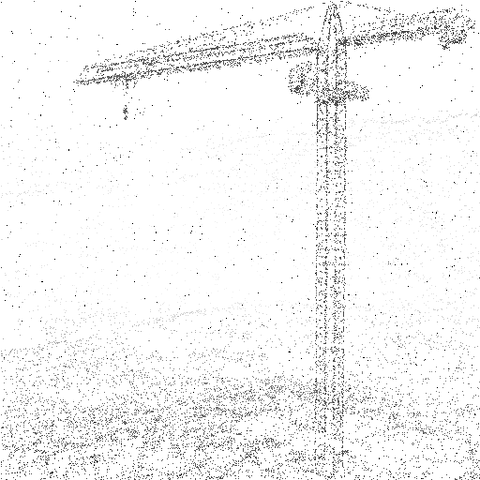
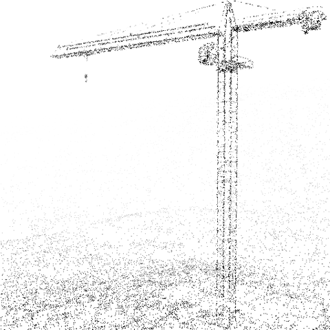

# DepthSplat: Incorporating Depth Information to Optimization

## Motivation

The primary motivation behind this adaptation was to improve the reconstruction of outdoor scenes featuring tall objects. In such cases, where drones or specialized equipment are unavailable, images are typically captured from the ground. This can pose challenges for the model, especially when dealing with cloudy backgrounds, as photometric loss alone struggles to resolve such scenes accurately. These reconstructions often exhibit cloudy artifacts around objects. From the ground perspective, and without depth information, the model cannot accurately determine the distance of the background, leading to reconstructions that overfit the specific viewpoint.

## Solution

The most direct solution to this problem is to incorporate depth information during reconstruction optimization. By doing so, the model can identify misaligned Gaussians, even if their rasterization appears correct from the given viewpoints. Our approach involved leveraging precomputed depth maps generated using DepthAnythingV2 for each input image. These depth maps were then rasterized during each optimization iteration and compared to the predicted depths.

### Implementation Details

Similar to how the original Gaussian Splatting implementation rasterizes the current Gaussian state to produce a predicted RGB image (used to compute the photometric loss against the ground truth image), we extended this idea to compute a depth loss. Specifically, we used ground truth depth maps from DepthAnythingV2 and devised a method to predict depth maps from the Gaussian state.

To compute the predicted depth map, we sampled points within each Gaussian, following its distribution parameters (i.e., considering the means, rotations, and scalings). These sampled points were projected into the camera's viewpoint, with the depth represented by the z-axis value in the camera coordinate system. This process generated a sparse predicted depth map, which was then compared with the ground truth depth map on overlapping points. The resulting differences were used to calculate the depth loss, guiding the optimization process. As a comparison of predicted and ground truth depth maps:

## Acknowledgements
This is an adaptation of the original implementation of [Gaussian Splatting](https://github.com/graphdeco-inria/gaussian-splatting) using [Depth Anything V2](https://github.com/DepthAnything/Depth-Anything-V2) to depth maps. We thank the original authors for their excellent work.

